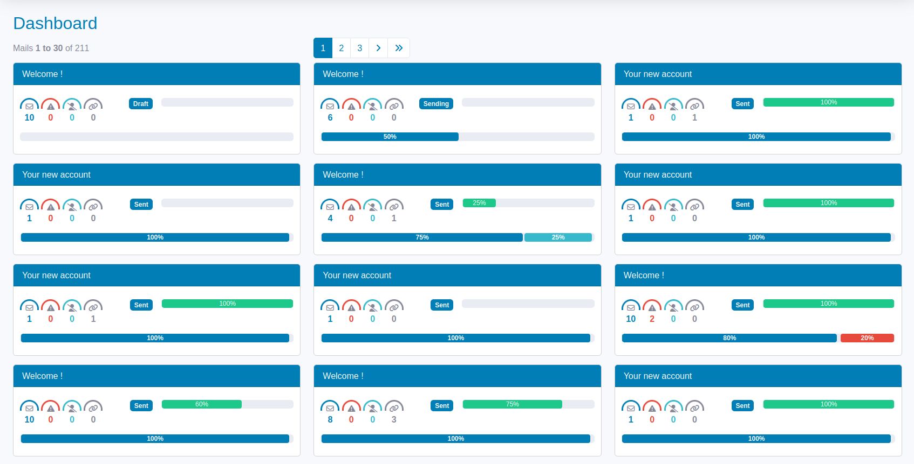

<h1 align="center">HermesBundle</h1>

<p align="center">
    <a href="https://github.com/2lenet/HermesBundle/actions" target="_blank">
        
    </a>
    <a href="https://github.com/2lenet/HermesBundle/actions" target="_blank">
        
    </a>
    <a href="https://github.com/2lenet/HermesBundle/actions" target="_blank">
        
    </a>
</p>

Simple mail manager for [Crudit Bundle](https://github.com/2lenet/CruditBundle).
You can use this bundle to create and send mails using templates.
It depends on [Symfony Mailer](https://github.com/symfony/mailer).



## Installation

Execute the following [composer](https://getcomposer.org/doc/00-intro.md) command to add the bundle to the dependencies of your project:

```bash
composer require 2lenet/hermes-bundle
```

Afterwards, visit the [documentation](docs/index.md) to find out how to set up and configure HermesBundle to your specific needs.

## Licence

HermesBundle is released under the under terms of the [MIT License](https://github.com/2lenet/HermesBundle/blob/main/LICENSE).

