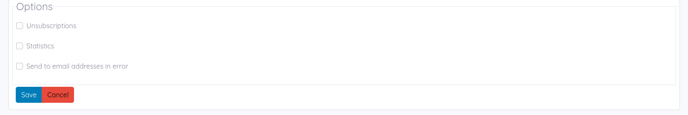

# Errors management

This bundle includes an error management.

## Principle

If a mail can't be delivered into a mailbox for some reason, this mail is sent back to the bounce server in the `bounce_user` mailbox.
A command will recover mails in this mailbox, check that it's an error email, and save it in database.

When a mail is sent, if the template defines it, the mail will not be sent to the recipient if the email address has already 3 errors. This number of retries can be configured.

## Configuration

Add the configuration to the `config/packages/lle_hermes.yaml` file of your project:

```yaml
lle_hermes:
    bounce_host: host.bounce.com
    bounce_port: 110
    bounce_user: user@bounce.com
    bounce_password: pass
    recipient_error_retry: 3
```

## Ignore errors

If you want to send a mail to a recipient who has already exceeded the maximum number of errors, you can activate option "Send to email addresses in error" in the template options:

