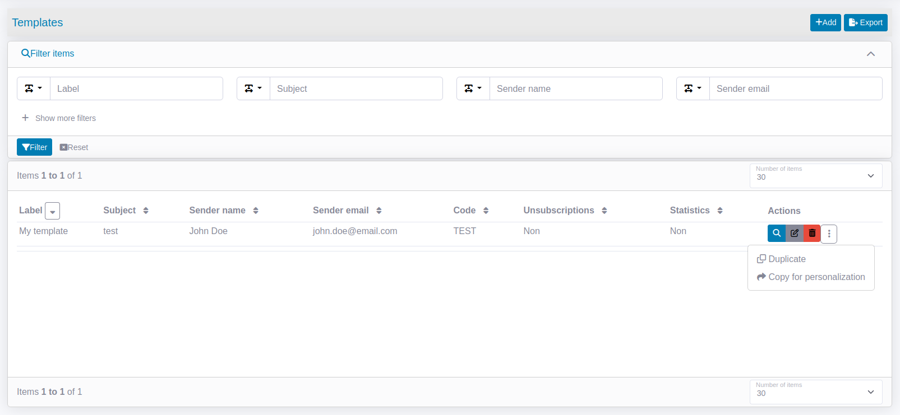
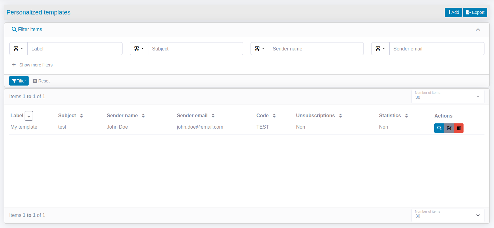

# Multitenant

This bundle includes an multitenant management.

## Principle

Have several instances filtered according to an entity linked to a user (e.g. its company, for a customer scope).
Templates, mails and recipients, can be filtered with multitenant.
If multitenant is configured, each instances can override the templates.

## Configuration
Add the FCQN in `tenant_class` line in `config/packages/lle_hermes.yaml`:

```yaml
# config/packages/lle_hermes.yaml
lle_hermes:
    tenant_class: App\Entity\Establishment
```

In your user entity, implement the `MultiTenantInterface` with the method `getTenantId()`:

```php
// src/Entity/User.php
<?php

namespace App\Entity;

use Lle\HermesBundle\Contracts\MultiTenantInterface;

#[ORM\Entity(repositoryClass: UserRepository::class)]
class User implements MultiTenantInterface
{
    // ...
    public function getTenantId(): int
    {
        return $this->getEstablishment()->getId();
    }
}
```

Now the dashboard, mail and recipient sections are filtered by establishment.


## Override template

If multitenant is configured, you can override the templates.

1. Go on the templates list page and click on "Copy for personalization" button.


2. The template is copied, you can personalize it as you want. It is visible in the Personalized templates screen.

