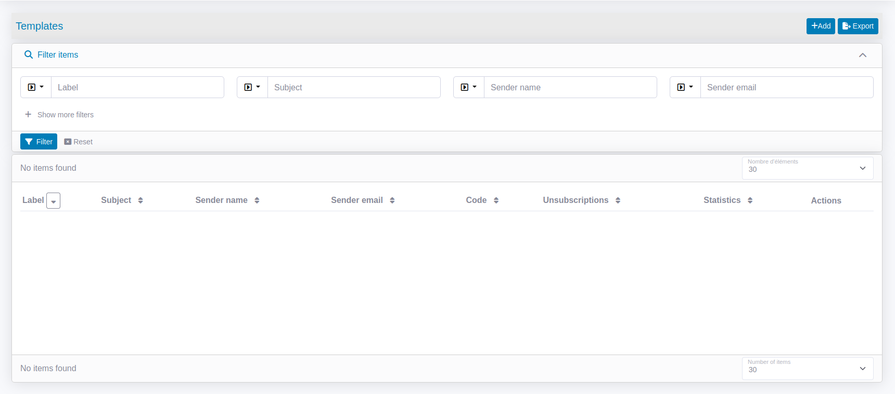
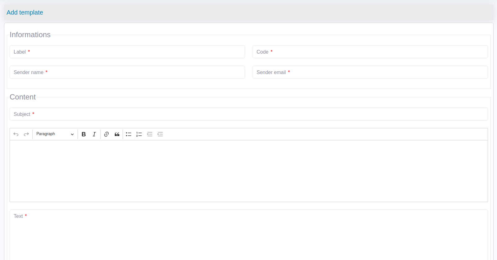

# Mail templating

The following is showing an example how you can create a mail template.

## Create a mail template

1. Go on the templates list page and click on "Add" button


2. Fill the form to create a new template


## Use variables

The fields `subject`, `text`, `html` and `senderName` allow [Twig](https://twig.symfony.com/) variables, conditions and loops.
The variables are replaced by the MailDto and the ContactDto objects when the template is rendered.
Each recipient of each mail use a new render of the template.

A variable is as the following :
```twig
Hello {{ user.fullName }},
Here is the link to reset your password : {{ url }}
```

Each variables defined in the templates must be set in `MailDto::$data` or in `ContactDto::$data` unless that an exception will be thrown. 

## Base64 images

If the template contains images base64 encoded, they will be stored on the server and replaced by a classic image in the mail content.
To configure the upload path of the images, see : [Configuration](configuration.md "File storage").
